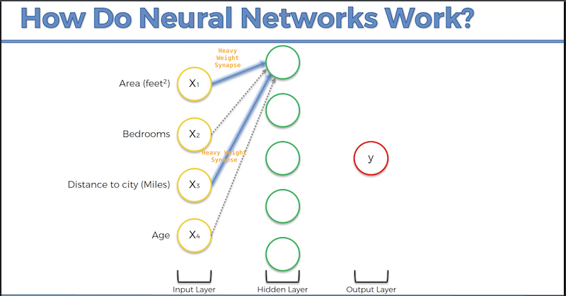

## Deep Neural Networks At Work 

In the following images imagine a simplified DNN that predicts housing costs. A _Property Evaluation DNN._

- Important concept is the specialization of neurons **(potentially, after being _correctly_ trained over and over again)** is that: **They can specialize in certain areas of the problem space. Thereby maximizing their ability to do _"one thing, really well"_**

- **Speciailizing** and **maximizing** single areas would create a situation like the following image in our property-evaluation dnn: The topmost neuron here tries to get any distance from city (location) as it relates to size of house (sqft) right. It knows there is a correlation between how much house you get, the further you are from a city or other imporant area (You pay a lot for a small condo in the city that in the country would get you double the number of rooms, etc).

