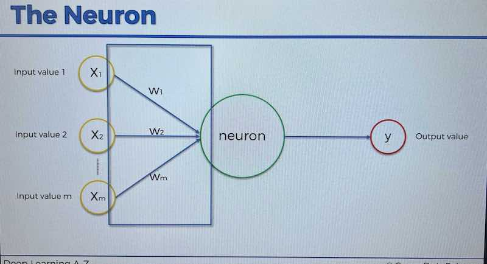
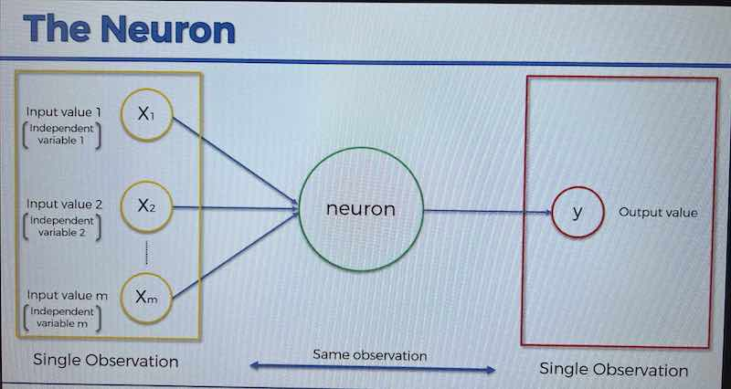

## Neuron (Node) Basics
- Input: _signals_ _(values)_ (yellow in diagram) which can be the input source or other neurons/nodes. These are the same as input variables in for instance linear regression. The signals/values need to be **normalized** or **standardized** 
- Synapses: are the connection layer between inputs and neurons (or likewise other neurons/nodes and other neurons/nodes). Learning is the process of analyzing and updating the **weighting** placed on the synapse. (W's in diagram)
- Weights: Arguably one of the most important aspects of the neuron-learning abstractinon. __Weights are what get adjusted through the process of learning__
- Outputs: Can be **continuous** (like a price), **binary** (yes or no), or **categorical** (several output varaibles).

- Notice how in this particular example the output values are _"all on the same **row**"_ as the input values.

- The actual action inside the neuron is a relatively simple **weighted summing of the inputs.** as seen in following illustration. _**Note that there is also an [**activation function**](./activation-function.md) that is applied to the whole neuron/node layer as a '3rd step' after the weighted summing function**_

